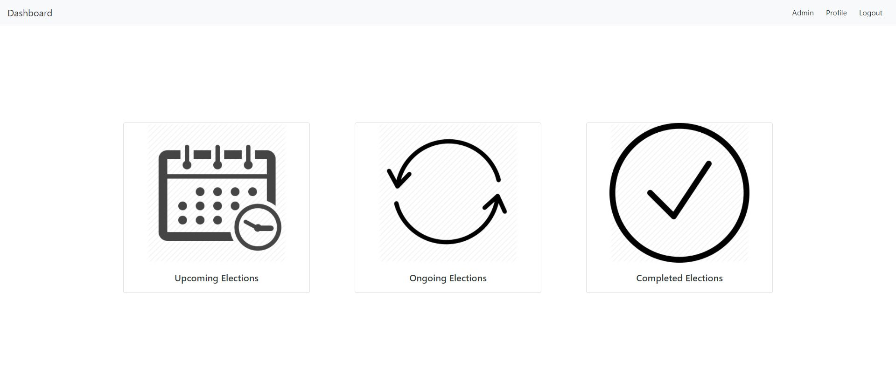

# Secure-Ranked-Choice-E-Voting

Secure Ranked Choice E-Voting is a web application that provides an easy-to-use method of collecting encrypted ballots that is secure against malicious actors, and capable of authenticating voters properly. Additionally, the web interface allows the tabulation of election results and the public posting of those results. The elections will follow ranked choice voting which has become more popular than single choice voting.

The goal of this project is to build and deploy a robust, secure, reliable and user-friendly online voting application. This is achieved with cryptography methods. Real life use cases for this software application include Student Council elections, official college-related elections and any other type of election.



Note: All screenshots can be found in the screenshots directory.

# Tech Stack

- Frontend: React
- Backend: Django Rest Framework
- Database: PostgreSQL

# Project Structure

```
.
├── Final Report.pdf
├── README.md
├── backend
│   ├── backend
│   │   ├── authentication
│   │   │   ├── __init__.py
│   │   │   ├── admin.py
│   │   │   ├── apps.py
│   │   │   ├── migrations
│   │   │   ├── models.py
│   │   │   ├── serializers.py
│   │   │   ├── tests.py
│   │   │   ├── urls.py
│   │   │   ├── utils.py
│   │   │   └── views.py
│   │   ├── backend
│   │   │   ├── __init__.py
│   │   │   ├── asgi.py
│   │   │   ├── settings.py
│   │   │   ├── urls.py
│   │   │   └── wsgi.py
│   │   ├── election
│   │   │   ├── __init__.py
│   │   │   ├── admin.py
│   │   │   ├── apps.py
│   │   │   ├── migrations
│   │   │   ├── models.py
│   │   │   ├── serializers.py
│   │   │   ├── tests.py
│   │   │   ├── urls.py
│   │   │   ├── utils.py
│   │   │   └── views.py
│   │   └── manage.py
│   └── requirements.txt
├── frontend
│   ├── README.md
│   ├── package-lock.json
│   ├── package.json
│   ├── public
│   │   ├── favicon.ico
│   │   ├── index.html
│   │   ├── logo192.png
│   │   ├── logo512.png
│   │   ├── manifest.json
│   │   └── robots.txt
│   └── src
│       ├── App.js
│       ├── axios.js
│       ├── components
│       │   ├── Admin
│       │   │   ├── AdminCompletedElectionContainerView.jsx
│       │   │   ├── AdminCompletedElectionView.jsx
│       │   │   ├── AdminDashboardContainerView.jsx
│       │   │   ├── AdminDashboardView.jsx
│       │   │   ├── AdminElectionContainerView.jsx
│       │   │   ├── AdminElectionView.jsx
│       │   │   ├── AdminNavbarContainerView.jsx
│       │   │   ├── AdminNavbarView.jsx
│       │   │   ├── AdminOngoingElectionContainerView.jsx
│       │   │   ├── AdminOngoingElectionView.jsx
│       │   │   ├── AdminUpcomingElectionContainerView.jsx
│       │   │   ├── AdminUpcomingElectionView.jsx
│       │   │   ├── CreateElectionContainerView.jsx
│       │   │   └── CreateElectionView.jsx
│       │   ├── Dashboard
│       │   │   ├── DashboardContainerView.jsx
│       │   │   ├── DashboardView.jsx
│       │   │   ├── NavbarContainerView.jsx
│       │   │   ├── NavbarView.jsx
│       │   │   ├── PageNotFoundContainerView.jsx
│       │   │   ├── PageNotFoundView.jsx
│       │   │   ├── ProfileContainerView.jsx
│       │   │   └── ProfileView.jsx
│       │   ├── Election
│       │   │   ├── BallotContainerView.jsx
│       │   │   ├── BallotView.jsx
│       │   │   ├── CompletedElectionContainerView.jsx
│       │   │   ├── CompletedElectionView.jsx
│       │   │   ├── ElectionContainerView.jsx
│       │   │   ├── ElectionView.jsx
│       │   │   ├── OngoingElectionContainerView.jsx
│       │   │   ├── OngoingElectionView.jsx
│       │   │   ├── ResultContainerView.jsx
│       │   │   ├── ResultStaticView.jsx
│       │   │   ├── ResultView.jsx
│       │   │   ├── UpcomingElectionContainerView.jsx
│       │   │   └── UpcomingElectionView.jsx
│       │   ├── User
│       │   │   ├── LoginContainerView.jsx
│       │   │   ├── LoginView.jsx
│       │   │   ├── MyProfileContainerView.jsx
│       │   │   ├── MyProfileView.jsx
│       │   │   ├── PasswordResetContainerView.jsx
│       │   │   ├── PasswordResetEmailContainerView.jsx
│       │   │   ├── PasswordResetEmailView.jsx
│       │   │   ├── PasswordResetView.jsx
│       │   │   ├── RegisterContainerView.jsx
│       │   │   ├── RegisterView.jsx
│       │   │   ├── VerifyEmailContainerView.jsx
│       │   │   └── VerifyEmailView.jsx
│       │   ├── styles
│       │   │   ├── CreateElectionView.css
│       │   │   ├── LoginView.css
│       │   │   ├── MyProfileView.css
│       │   │   ├── PageNotFound.css
│       │   │   ├── PasswordResetEmailView.css
│       │   │   ├── PasswordResetView.css
│       │   │   ├── RegisterView.css
│       │   │   ├── ResultView.css
│       │   │   └── VerifyEmailView.css
│       │   └── utils
│       │       ├── authentication.js
│       │       ├── response.js
│       │       └── user.js
│       ├── images
│       │   ├── completed.png
│       │   ├── lighthouse.jpg
│       │   ├── ongoing.jpg
│       │   └── upcoming.jpg
│       └── index.js
└── screenshots

19 directories, 138 files
```

# Backend Setup

## 1. Create a new virtual environment

```
cd backend
python -m venv env
```

## 2. Activate the virtual enviromnent

On Windows

```
env\Scripts\activate
```

On Linux

```
source env/bin/activate
```

## 3. Install python packages

On Linux

```
sudo apt install libpq-dev python3-dev
pip install wheel
pip install -r requirements.txt
```

On Windows

```
pip install -r requirements.txt
```

## 4. Setup environment variables

- Create a .env file at the root directoy of the backend (at the same level as `manage.py`)
- Add secret keys using the .env.example file as reference

## 5. Setup Django Database

```
cd backend
python manage.py migrate
```

## 6. Start Django Restful API

```
python manage.py runserver
```

# Frontend Setup

```
cd frontend
npm ci
npm start
```

# Local Database Setup

- Create a new local PostgreSQL database using PgAdmin
- Add all required environment variables in the .env file using the .env.example file as reference

# Resources

- [Django Rest Framework](https://www.django-rest-framework.org/)
- [React](https://reactjs.org/tutorial/tutorial.html)
